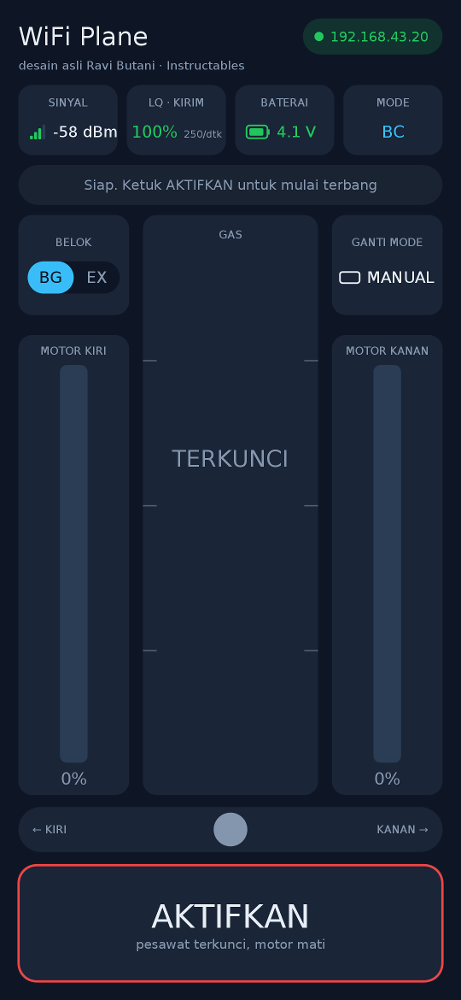
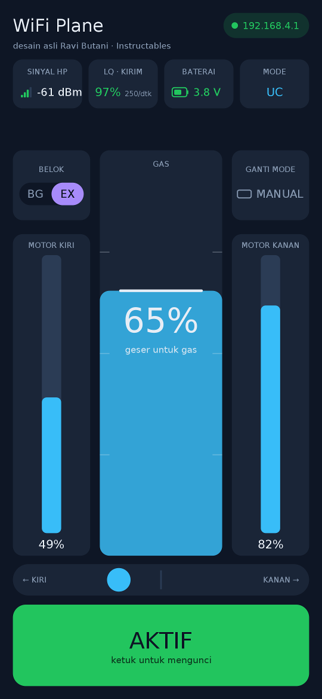
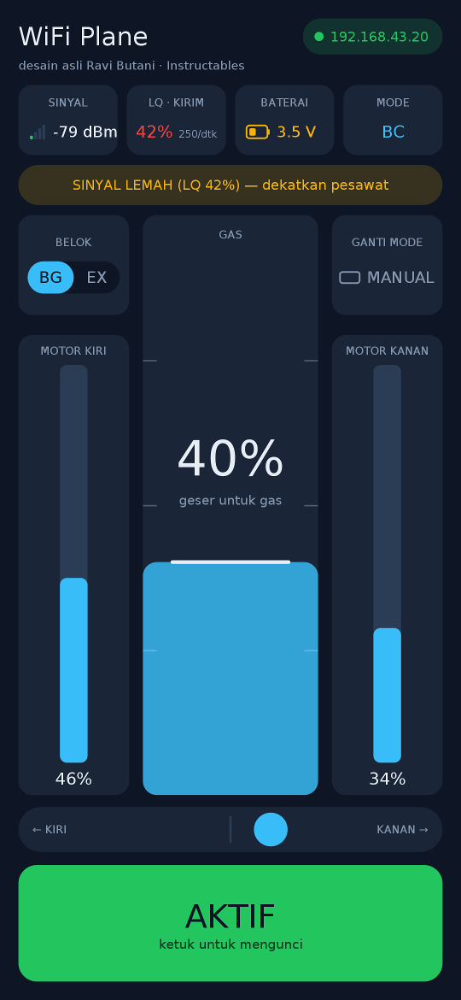
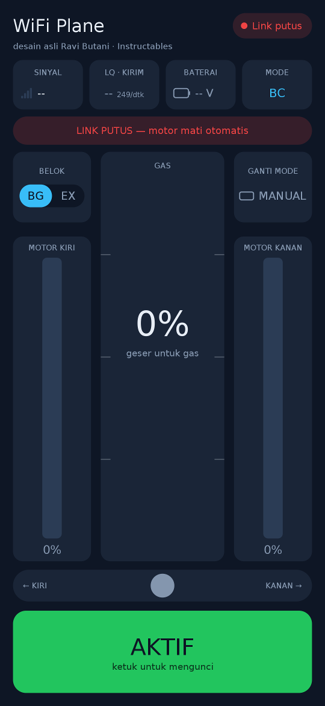
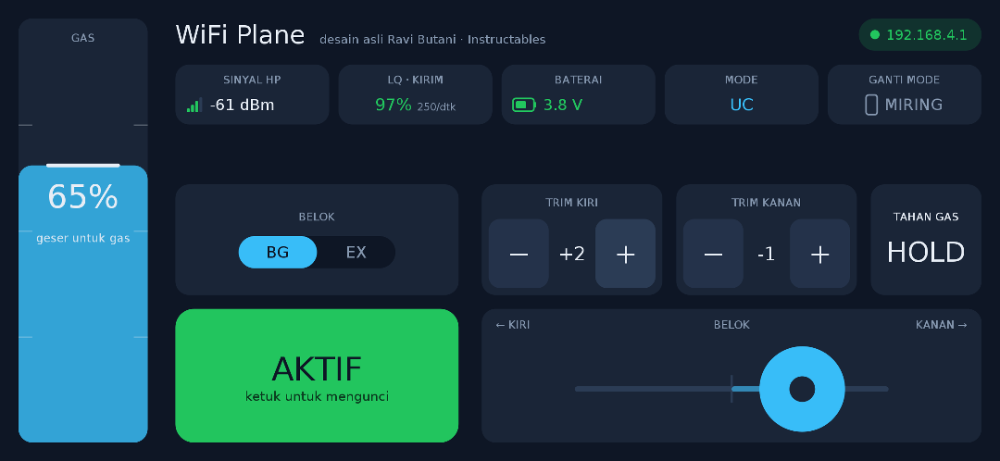
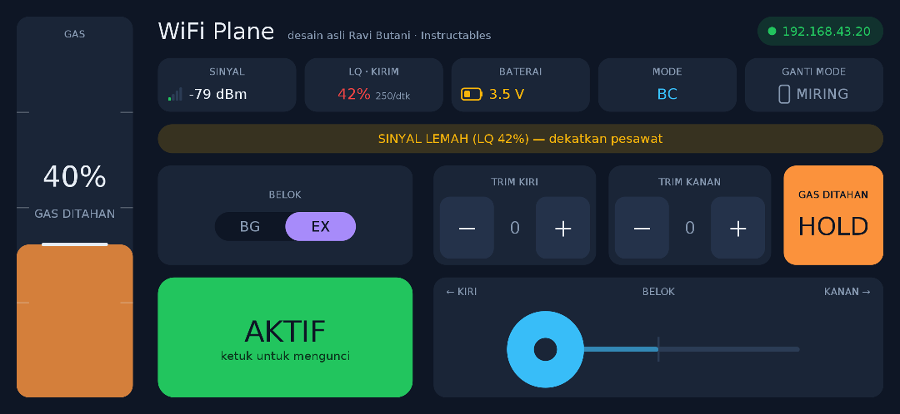

# esp01-wifiplane

Kode hasil modifikasi untuk ESP-12E yang menjalankan [WIFI-CONTROLLED-RC-PLANE](https://www.instructables.com/id/WIFI-CONTROLLED-RC-PLANE/) buatan [RAVI_BUTANI](https://www.instructables.com/member/RAVI_BUTANI/), pesawat RC DIY termurah, yang disetel untuk jangkauan maksimal.

**Perangkat keras**

* ESP-12E (atau ESP-12F, NodeMCU, Wemos D1 mini) dirangkai seperti [skema asli](Hardware/original-electronics.png), LED status di gpio2.

* Motor sesuai skema asli: motor kanan di gpio4 (T2, `MOTOR_KANAN`), motor kiri di gpio5 (T1, `MOTOR_KIRI`). HP dimiringkan ke kiri membuat motor kanan lebih kencang, sehingga pesawat belok kiri. Tombol trim kiri menambah motor kanan (trim ke kiri), tombol trim kanan menambah motor kiri.

* Tegangan baterai dibaca di A0 lewat pembagi tegangan 33k / 8.2k.

**Sebelum flashing**

* Di sketch, isi `ssid_sta` / `pass_sta` (WiFi rumah untuk OTA, atau hotspot HP), `pass_ap` (minimal 8 karakter) dan `OTA_PASSWORD`. Jangan commit password asli.

* Samakan `BIND_ID` di sketch dan aplikasi, supaya HP atau pesawat lain yang memakai kode ini tidak bisa mengendalikan pesawat Anda.

* Build ulang aplikasi dari `ProcessingAndroidApp/wifiplane/wifiplane.pde` di Processing (mode Android). File `wifiplane.apk` bawaan adalah versi lama dan tidak bisa dipakai dengan firmware ini. Izin yang dibutuhkan aplikasi ada di `AndroidManifest.xml`, dan izin yang kurang ditampilkan di layar. File itu juga berisi `android:configChanges` supaya aplikasi tidak restart saat ganti mode MIRING / MANUAL. Kalau Anda menyalin kode ke sketch sendiri, salin juga `AndroidManifest.xml` ke folder sketch itu (atau tambahkan atribut `android:configChanges` dari file ini ke `<activity>` di manifest Anda). Tanpa itu, ganti mode tetap jalan tapi Android membuat ulang aplikasi, sehingga BG/EX kembali ke BG (trim tetap, karena disimpan).

**Mode WiFi**

* Saat dinyalakan, pesawat mencoba tersambung ke `ssid_sta` (WiFi rumah atau hotspot HP) sampai 20 detik (`STA_TUNGGU_MS`, 3 bip kalau berhasil), supaya router yang lambat tidak membuat pesawat masuk mode AP.

* Kalau gagal, pesawat menjadi access point `wifiplane` di kanal 1, 6 atau 11 yang paling sepi (2 bip). Sambungkan HP ke WiFi ini. Di luar jangkauan WiFi rumah, AP siap sekitar 20 detik setelah pesawat dinyalakan.

* Update OTA (port Arduino IDE `wifiplane-ota`, meminta `OTA_PASSWORD`) lewat mode STA (WiFi rumah atau hotspot HP). Mode AP menjadi cadangan kalau STA tidak bisa tersambung: sambungkan PC ke `wifiplane`. Di kedua mode, OTA dan mDNS hanya berjalan saat aplikasi remote tidak terbuka: aktif setelah 10 detik tanpa paket kendali (`OTA_TUNDA_MS`) dan langsung mati begitu aplikasi mengirim lagi, sehingga tidak pernah berjalan saat terbang. Setelah pesawat dinyalakan tanpa aplikasi, tunggu sekitar 10 detik sebelum upload.

* Mode dipilih sekali saat pesawat dinyalakan dan dipertahankan sampai pesawat dimatikan.

**Mode aman**

* Kalau firmware crash 3 kali berturut-turut (reset karena exception atau watchdog, `CRASH_MAKS`), misalnya setelah update yang rusak, pesawat menyala dalam mode aman: motor tidak pernah digerakkan, tanpa bunyi bip, LED berkedip ganda setiap detik, dan hanya WiFi (STA, kalau gagal AP) dan OTA yang berjalan, dengan OTA langsung aktif. Upload firmware yang sudah diperbaiki lewat OTA, atau cabut lalu pasang lagi baterai untuk mencoba start normal.

* Setelah 30 detik berjalan normal (`STABIL_MS`), hitungan crash kembali ke 0. Hitungan ini disimpan di RTC memory, jadi mencabut baterai juga menghapusnya.

* Mode aman hanya menolong kalau firmware baru masih mengandung kode mode aman dan crash-nya terjadi setelah firmware mulai berjalan. Pertahankan kode mode aman di setiap versi yang Anda upload.

**Rollback**

* Upload OTA yang gagal (koneksi putus, password salah, MD5 tidak cocok, baterai dicabut saat upload) tidak pernah menyentuh firmware yang sedang berjalan: image baru ditulis dulu ke flash yang kosong dan baru disalin setelah MD5-nya cocok. Jangan cabut daya sekitar 10 detik setelah upload selesai, saat bootloader menyalinnya.

* Untuk upload yang berhasil tapi firmware-nya crash, pesawat menyimpan salinan firmware baik terakhir. Pilih Flash Size yang punya file system di Arduino IDE, misalnya "4MB (FS:1MB OTA:~1019KB)". Tanpa file system, rollback nonaktif dan crash berulang hanya berujung ke mode aman.

* Firmware yang sudah berjalan 2 menit tanpa crash (`VERSI_BAIK_MS`) disalin ke file system, sekali per versi, hanya saat aplikasi remote tertutup. Pada crash ke-3 berturut-turut, pesawat memasang salinan itu (dicek MD5) lalu restart dengannya. Kalau tidak ada salinan, atau salinannya justru versi yang crash, pesawat masuk mode aman.

**Pengaturan jangkauan (firmware)**

* Hanya 802.11b, modem sleep mati, kalibrasi RF penuh setiap dinyalakan, daya pancar di level tertinggi tabel PHY (19,5 dBm).

* Kiriman pesawat sendiri (telemetri, OTA) dimulai di 1 Mbps, rate yang paling peka. Rate paket kendali dipilih oleh HP.

* `EKSP_AP_RATE_1_2M` (mati secara default, eksperimen) membuat access point hanya mengiklankan 1 dan 2 Mbps, sehingga HP juga mengirim di rate itu. Uji dulu di darat.

**Link**

* Aplikasi mengirim paket kendali 5 byte pada 250 Hz: `[BIND_ID, seq lo, seq hi, PWM kanan, PWM kiri]`. Paket yang byte pertamanya bukan `BIND_ID` pesawat ini dibuang. Tidak ada checksum tambahan: WiFi sudah mengecek setiap frame dengan CRC-32 di hardware.

* Aplikasi memilih mode kirim sendiri dan menampilkannya di bilah status (MODE). BC (broadcast) saat HP menjadi hotspot: tanpa pengulangan WiFi, tanpa antrean selama pesawat satu-satunya perangkat di hotspot. UC (unicast, dikonfirmasi dan diulang) saat HP menjadi klien WiFi, baik ke access point pesawat maupun ke WiFi rumah: di sana broadcast tidak memberi keuntungan dan bisa tertunda atau terkirim dua kali.

* Pesawat hanya memakai paket terbaru, membuang paket basi dan duplikat berdasarkan nomor urut, dan menghitung link quality (LQ) dari nomor yang terlewat. Motor dimatikan setelah 900 ms tanpa paket.

* Sekali per detik pesawat mengirim `[BIND_ID, RSSI, VBAT*10, LQ %]`, lewat broadcast sampai ada HP yang mengendalikannya dan lewat unicast setelahnya, sehingga aplikasi menemukan pesawat dengan sendirinya. Di mode access point pesawat tidak bisa mengukur RSSI, jadi aplikasi menampilkan RSSI yang diukur HP ("HP").

**Tampilan remote**

Ada dua mode kemudi, diganti dengan tombol GANTI MODE saat terkunci:

* MIRING (layar potret): belok dengan memiringkan HP (sensor accelerometer), gas di slider tengah. Tanpa trim.

* MANUAL (layar landscape): gas di slider kiri (ibu jari kiri, geser ke atas), belok di slider horizontal kanan-bawah (ibu jari kanan, geser ke kiri/kanan), trim dan HOLD di atas slider belok.

Mode MIRING:

| Siap | Terbang, belok kiri | Sinyal lemah | Link putus |
|---|---|---|---|
|  |  |  |  |

Mode MANUAL:

| Terbang, belok kanan | HOLD, belok kiri penuh, sinyal lemah |
|---|---|
|  |  |

Gambar di atas dirender dari kode `draw()` yang sama; huruf di HP bisa sedikit berbeda.

* Atas: status koneksi ke pesawat (alamat IP, "Mencari pesawat…" atau "Link putus"), lalu sinyal, LQ · KIRIM, baterai (warna hijau/kuning/merah sesuai level) dan mode kirim BC/UC.

* LQ · KIRIM: angka besar = LQ, persen paket kendali yang diterima pesawat (dihitung FC dari nomor urut, hanya paket yang hilang di udara). Angka kecil = jumlah paket kendali yang benar-benar dikirim HP per detik, normalnya sekitar 250. Kuning kalau di bawah 200 (HP tidak sanggup mengirim secepat itu), 0 kalau HP belum atau tidak mengirim. LQ tidak membatasi gas atau motor; motor hanya dimatikan oleh failsafe (900 ms tanpa paket) dan pemutus baterai.

* Di bawahnya muncul satu pesan kalau ada yang perlu diperhatikan: link putus, baterai lemah, sinyal lemah, izin kurang, atau petunjuk saat siap terbang.

* BELOK: pilihan BG (belok halus) atau EX (belok tajam), yang aktif disorot. Ketuk untuk mengganti. Berlaku di kedua mode.

* GANTI MODE: ikonnya menunjukkan posisi HP setelah diganti (MANUAL = landscape, MIRING = potret).

* Mode MIRING: output motor kiri dan kanan dalam persen di kiri-kanan slider gas (dihitung dengan rumus yang sama dengan paket yang dikirim), dan indikator kemiringan HP di bawahnya.

* Mode MANUAL: trim kiri dan kanan ([−] nilai [+]) dan HOLD di atas slider belok, supaya bisa diketuk ibu jari kanan selagi ibu jari kiri memegang gas. AKTIFKAN di kiri-bawah, jauh dari titik ibu jari kanan.

* Setiap tombol bergetar singkat saat diketuk.

**Kendali dan keselamatan**

* Multi-touch: setiap jari dibaca sendiri, jadi gas, belok dan tombol bisa dipakai bersamaan, misalnya menahan gas sambil mengetuk HOLD, trim atau BG/EX dengan jari lain.

* Gas: sentuh dan geser slider gas, atas = penuh. Gas langsung mengikuti jari saat slider disentuh, dan hanya jari yang mulai menyentuh di slider saat AKTIF yang mengubah gas; jari lain yang ikut menyentuh slider diabaikan. Jari gas diangkat membuat gas menjadi 0, walaupun jari lain masih menyentuh layar, sehingga motor mati saat pesawat jatuh. Saat gas 0, kedua motor mati, apa pun kemiringan, slider belok dan trim-nya.

* Belok (mode MANUAL): kenop mengikuti jari, ujung slider sama dengan HP miring 90 derajat di mode MIRING, dan BG/EX tetap berlaku. Jari diangkat membuat pesawat lurus lagi. Ada zona mati kecil di tengah. Di mode MANUAL kemiringan HP tidak dipakai.

* HOLD (hanya mode MANUAL, oranye saat aktif, hanya bisa saat AKTIF): gas ditahan walaupun jari diangkat, sehingga ibu jari kiri bebas, misalnya untuk mengatur trim. Ketuk lagi untuk mematikannya, yang juga membuat gas menjadi 0; kalau jari masih di slider gas, angkat dulu untuk memberi gas lagi. Mode MIRING tidak punya HOLD.

* Trim (hanya mode MANUAL): TRIM KIRI menambah motor kanan (pesawat cenderung ke kiri), TRIM KANAN menambah motor kiri. Batas ±30 per trim. Nilainya disimpan di memori aplikasi setiap kali diketuk, jadi tetap ada saat aplikasi ditutup dan dibuka lagi. Di mode MIRING trim tidak dipakai.

* AKTIFKAN / AKTIF mengunci dan membuka kendali. Mengunci juga mematikan HOLD dan membuat gas menjadi 0. Jari yang sudah ada di slider gas saat AKTIFKAN diketuk tidak memberi gas; angkat dan sentuh lagi.

* Ganti mode hanya bisa saat terkunci. Saat AKTIF, tombolnya redup dan muncul pesan "Kunci dulu untuk ganti mode". Layar landscape dikunci ke satu arah (tidak ikut sensor), jadi tidak berputar sendiri saat terbang. Kalau bentuk layar tetap berubah saat AKTIF (misalnya layar terpisah), kendali langsung dikunci.

* HP bergetar saat baterai lemah (di bawah 3,0 V, paling lama 2 detik sebelum pesawat memutus motor), dan saat AKTIF ketika link putus atau LQ di bawah 50%.

* Pesawat memutus motor saat tegangan baterai bertahan di bawah 3,0 V (batas mutlak LiPo 1S saat dibebani) selama 2 detik, sehingga penurunan sesaat saat gas penuh tidak memutusnya. Motor bisa dipakai lagi setelah tegangan naik dan gas kembali ke 0.

* Saat aplikasi di-pause (telepon masuk, layar dikunci, pindah aplikasi), kendali dikunci dan gas 0 dikirim selama 1 detik, lalu pengiriman berhenti dan lock dilepas.

**HP**

* Hotspot: pita 2,4 GHz, opsi "matikan hotspot otomatis" dimatikan, dan tidak ada perangkat lain yang tersambung.

* Access point pesawat: matikan data seluler, atau pilih "tetap terhubung" saat Android memberi tahu jaringan tidak punya internet. Aplikasi juga mengikat socket-nya ke jaringan itu.

* Matikan penghemat baterai, dan jangan tutupi tepi HP dengan tangan karena antena WiFi biasanya ada di sana. Aplikasi menjaga layar tetap menyala.
